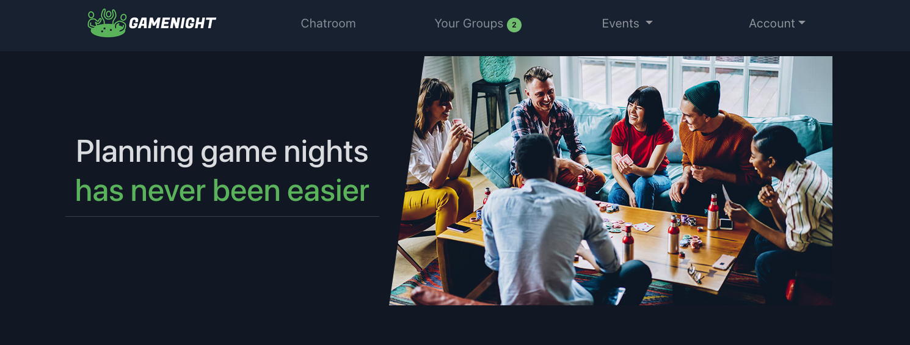
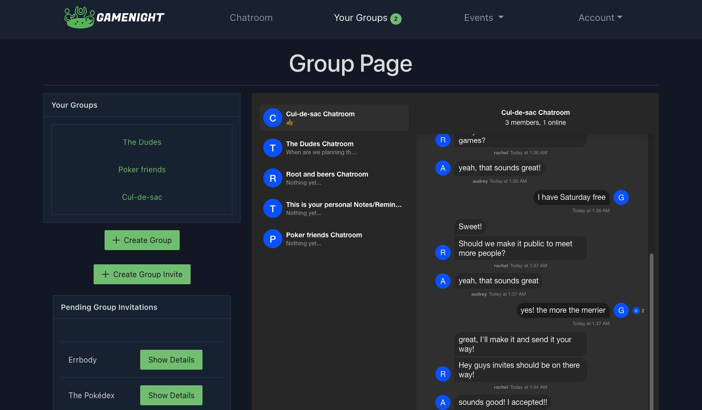
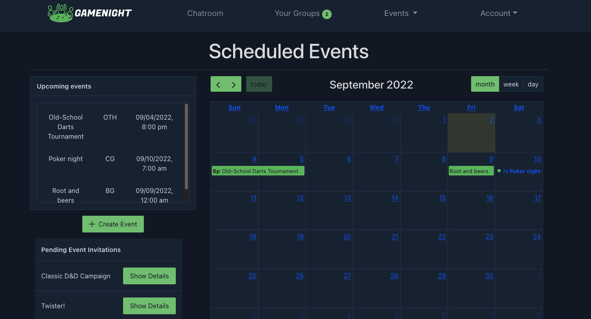
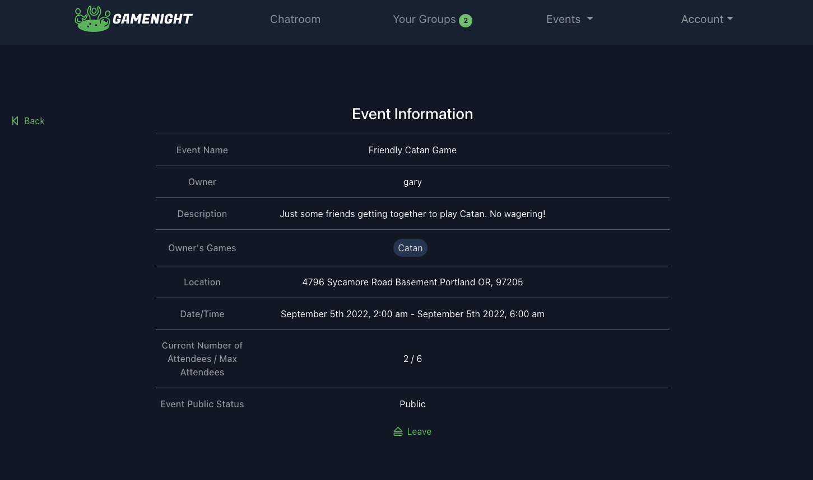

<table>
<tr>
<td>
    GameNight welcomes all board game, card game, dice, DnD, and other game enthusiasts! Our site makes it easy to plan the perfect game night! Create a private game night with just your close-knit friends, or create and search for public games in your area. Use the calendar and chatroom to make communication and scheduling a piece of cake! Lets play!
</td>
</tr>
</table>

## Demo 
Here is a working live demo :  https://game-night.net

## Site 

### Landing Page
Sign up and start planning your next event!

### Groups and Chat
Talk to your groups and invite your friends

### Events
Schedule new events and update your calendar

### Details
Share information for your public or private event

## Usage

### Development
Want to contribute? Great!

To contribute with the code, fixing a bug or adding new features, follow these steps:

- Fork the repo
- Create a new branch (`git checkout -b improve-feature`)
- Make the changes in the files
- Stage the changes (`git add 'changed-file'`)
- Commit your changes (`git commit -am 'Improve feature'`)
- Push to the branch (`git push origin improve-feature`)
- Create a Pull Request

### Bug / Feature Request

If you find a bug, you can open a new issue [here](https://github.com/Romeo-Best-Team/game-night/issues/new), including information about how to replicate the bug.

If you want to request a new function, feel free to open a new issue [here](https://github.com/Romeo-Best-Team/game-night/issues/new). Include as many details as you can.

## Built with 

- Django
- React
- PostgresQL

## Team
[Megann Herdegen](https://github.com/m-herdegen) | [Alisha Burgfeld] (https://github.com/alishaburgfeld) | [Daniel Pizarro] (https://github.com/Galuf1) | [Kaylee Burch] (https://github.com/kayleeburch) | [Michael Heinzinger] (https://github.com/MHeinz1996) | [Craig Bucher] (https://github.com/craigbucher)